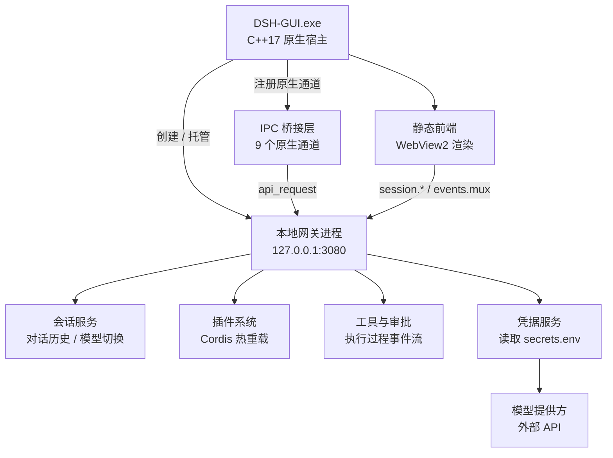

<div align="center">

# DSH-GUI

**DeepSeek Harness 的原生桌面工作台**

<p>


</p>

</div>

---

## 目录

- [一、这是什么](#一这是什么)
- [二、架构总览](#二架构总览)
- [三、运行方式](#三运行方式)
- [四、核心功能](#四核心功能)
- [五、目录结构](#五目录结构)
- [六、配置文件与密钥隔离](#六配置文件与密钥隔离)
- [七、从源码构建](#七从源码构建)
- [八、注意事项](#八注意事项)
- [九、交流与反馈](#九交流与反馈)

---

## 一、这是什么

DSH-GUI 是 DeepSeek Harness（下称 dsh）的**原生桌面客户端**。它把原本跑在终端里的 Agent 会话，搬进了一个带会话列表、模型切换、插件管理和审批交互的图形工作台。

整个程序由两层组成：外层是一个用 C++17 编写的原生宿主进程，负责开窗口、接收原生交互、拉起并托管后端的 Node.js 网关；内层是 dsh 本体——一个基于 Cordis 插件框架的 TypeScript Agent 运行时，监听在本地 `127.0.0.1:3080`。前端的界面资源是纯静态的 HTML/CSS/JS，由 WebView2 内核渲染，不经过任何打包步骤。

> 本项目中的 Jade 前端仅作为视觉参考实现，参考项目本身保持原样、未被修改。

## 二、架构总览

分层的核心目的是**把密钥和模型调用留在服务端**：前端只负责展示和交互，所有需要凭据的动作都由本地网关完成。



- **原生宿主**：用 `CreateProcessW` 启动 `start-dsh.ps1`，轮询端口等待网关就绪（上限约 45 秒），并通过 Windows Job Object 绑定子进程生命周期，保证 GUI 退出时**只关掉它自己启动的网关实例**。
- **IPC 桥接层**：宿主注册了 9 个原生通道，分别是 `window_control`（窗口控制）、`model_groups`（读取本地模型分组）、`api_request`（转发请求到网关）、`plugin_toggle`（插件开关）、`open_full_workspace`（打开完整工作台）、`session_context_action`（会话右键操作）、`session_archive`（会话归档）、`approval_action`（审批确认）、`clipboard_read`（剪贴板兜底读取）。
- **静态前端**：与网关通信只使用两组端点——`/api/session.*` 处理会话类操作，`/api/events.mux` 拉取事件流。**前端从不发送、也不渲染 API Key。**

## 三、运行方式

1. 把模型提供方的密钥写入 `%USERPROFILE%\.dsh\secrets.env`，形如 `DEEPSEEK_API_KEY=...`。
2. 把模型分组写进 `%USERPROFILE%\.dsh\models.yaml`。
3. 运行 `tools\build-dsh-studio.cmd`，编译产物会发布为 `%USERPROFILE%\.dsh\DSH-GUI.exe`。
4. 直接启动 `DSH-GUI.exe`。它会拉起本地网关、等待端口就绪，并在退出时清理自己启动的网关实例。

首次接触项目时，可以先复制模板上手：

```powershell
Copy-Item secrets.env.example secrets.env
Copy-Item settings.example.yaml settings.yaml
# 然后编辑这两个文件，填入自己的提供方地址与密钥
```

## 四、核心功能

### 4.1 会话管理

左侧边栏维护完整的会话列表，支持按标题搜索、按活跃/归档两个视图切换。每个会话拥有独立的会话 ID，点击即可加载历史消息；右键可执行打开工作区文件夹、复制会话 ID、归档、彻底删除四类操作。彻底删除采用双重确认，先提示影响范围、再二次确认，避免误删。

### 4.2 模型切换与分组

模型列表来自本地 `models.yaml`，按分组展示（例如「DeepSeek」分组下可列出多个模型）。切换模型即时生效，无需重启会话。前端会把本地定义的分组与网关实际可用的模型做合并排序，**以本地配置的展示顺序为准**。

### 4.3 插件热重载

点击左下角的「插件」入口可打开插件清单页，展示每个插件的模块名、标识、启用状态与加载阶段，支持按名称搜索、按启用/禁用筛选。非核心插件提供真实开关：切换后会写入本地的 `profiles\web\cordis.patch.yml`（经由私有的 `plugin-overrides.conf` 状态文件），并由 dsh 的配置热重载即时生效，无需重启服务。

网关、Web 运行时、加载器、插件清单等**核心插件受保护**——禁用它们会直接切断或破坏管理界面，因此界面上这些开关处于禁用状态。

### 4.4 执行过程可视化

Agent 执行任务时，消息区会生成一张「执行过程」卡片，实时反映当前进度：分析规划、调度工具、重试请求、等待审批等阶段逐条滚动。卡片状态会随回合（turn）起止自动切换为「正在执行 / 已完成 / 已失败 / 已中断」。

### 4.5 权限与审批

会话支持三档权限：**只读**、**工作区写入**、**完全访问**。切换完全访问前会先弹出确认。当 Agent 需要执行高风险操作时，界面上会弹出一次性的授权请求，可选择「允许一次」或「拒绝」，确认结果回传给网关后继续或中止执行。

### 4.6 外观与壁纸

打开「设置与模型」可在黑色/白色两套主题间切换。壁纸层默认关闭，开启「壁纸背景」后会启用半透明工作区，并可从内置预设中挑选。所有预设都是 `jade-frontend\web\wallpapers` 下的本地文件，程序**不会在运行时联网拉取图片**，其来源与许可记录在同目录的 `SOURCES.md` 中。

## 五、目录结构

```
.dsh/
├── deepseek-harness/        # Node.js / TypeScript 的 Cordis 插件化 Agent 框架
├── jade-frontend/           # C++ 宿主与静态前端
│   ├── src/main.cpp         # 宿主主程序：窗口、IPC、进程生命周期
│   ├── sdk/JadeView.h       # JadeView SDK 头文件
│   ├── web/                 # 纯静态 HTML / CSS / JS 前端
│   │   └── wallpapers/      # 内置壁纸预设与来源说明
│   └── DSHStudio.vcxproj    # MSVC 工程文件
├── tools/                   # 构建脚本
│   ├── build-dsh-studio.cmd # 一键编译并发布 DSH-GUI.exe
│   └── vs2019-x64.cmd       # 初始化 MSVC x64 编译环境
├── models.yaml              # 模型分组配置（可发布）
├── secrets.env.example      # 密钥模板（可发布）
├── settings.example.yaml    # 设置模板（可发布）
├── start-dsh.ps1            # 网关启动脚本
└── README.md
```

### 5.1 关于随包分发的上游子项目

`deepseek-harness/` 是**随包分发的上游项目**，其文档沿用上游自己的**双语体系**，本项目刻意保持原样，以便后续能顺利同步上游更新：

- 文件名带 `.zh.md` 后缀的才是**中文版**，例如 `deepseek-harness/README.zh.md`、`deepseek-harness/CONTRIBUTING.zh.md`，以及各子包下的 `README.zh.md`。
- 点进某个子包目录时，GitHub 默认渲染的是上游的英文 `README.md`；中文版就在**同目录**的 `README.zh.md` 里。
- 本仓库**根目录**的 `README.md`（即你正在读的这份）是本项目自己产出的文档，已全中文。

> 如果你要找某段说明的中文版，把对应路径的 `README.md` 换成 `README.zh.md` 即可。

## 六、配置文件与密钥隔离

密钥隔离是本项目最重要的一条安全约定：**API Key 只由服务端读取，前端不接触、不发送、不渲染。**

| 文件 | 是否可发布 | 说明 |
|---|---|---|
| `models.yaml` | ✅ 可发布 | 只含模型分组与公开的模型 ID |
| `secrets.env.example` | ✅ 可发布 | 占位符模板，无真实密钥 |
| `settings.example.yaml` | ✅ 可发布 | 脱敏设置模板 |
| `secrets.env` | ❌ 禁止入库 | 含真实 API Key，必须留在版本控制之外 |
| `settings.yaml` | ❌ 禁止入库 | 私有设置，含本机提供方地址 |

在把仓库公开之前，请先确认已跟踪文件中不残留真实密钥：

```powershell
rg -n "sk-[A-Za-z0-9]{20,}|DEEPSEEK_API_KEY=" --glob '!secrets.env' .
```

## 七、从源码构建

构建原生宿主需要 **Visual Studio 2019**（含 MSVC x64 工具链）。项目链接的是 `jade-frontend\sdk` 下的 JadeView SDK。

```cmd
REM 在仓库根目录执行
tools\build-dsh-studio.cmd
```

脚本会依次完成：初始化 MSVC x64 编译环境 → 用 MSBuild 编译 `jade-frontend\DSHStudio.vcxproj` → 把生成的 `DSH-GUI.exe` 与 `JadeView_x64.dll` 复制到仓库根目录。

脚本默认使用 Visual Studio 2019 社区版的安装路径。如果你的安装位置不同，可以先设置以下环境变量再执行，无需改动脚本：

```cmd
set VS_DEV_CMD=D:\你的路径\Common7\Tools\VsDevCmd.bat
set VS_MSBUILD=D:\你的路径\MSBuild\Current\Bin\amd64\MSBuild.exe
tools\build-dsh-studio.cmd
```

发布出来的根目录可执行文件，会使用 `jade-frontend\web` 下的前端资源，以及 `%USERPROFILE%\.dsh\models.yaml` 中的模型目录。

## 八、注意事项

- **代理设置**：`start-dsh.ps1` 会在环境变量 `HTTPS_PROXY` 未设置时，自动为网关加载本机代理。请勿把代理凭据写进任何前端文件。
- **端口占用**：网关固定监听 `127.0.0.1:3080`。若该端口已被占用，宿主会复用现有监听，而不是重复启动。
- **进程清理**：宿主通过 Job Object 管理网关生命周期，只会结束自己启动的实例，不影响你手动运行的其他 dsh 进程。
- **壁纸来源**：内置壁纸预设转自分发于 MIT 许可仓库的素材，发布时请连同 `jade-frontend\web\wallpapers\SOURCES.md` 一起保留。

## 九、交流与反馈

<div align="center">

<p><strong>遇到问题？欢迎加群交流 —— 版本更新与问题答疑第一时间同步</strong></p>

<p>
<a href="https://qm.qq.com/q/89nIPLRrCU" title="易语言+AI-吹牛逼（群号 607124662）"></a>
&nbsp;&nbsp;
<a href="https://qm.qq.com/q/Fv9KjpGCEq" title="易语言 jadeView前端UI（群号 1103426302）"></a>
</p>

<p>
<strong>易语言+AI-吹牛逼</strong> ｜ 群号 <code>607124662</code><br>
<strong>易语言 jadeView前端UI</strong> ｜ 群号 <code>1103426302</code>
</p>

<p><sub>点击上方按钮即可一键加群，无需手动搜索群号</sub></p>

</div>

---

<div align="center">

**DSH-GUI · 让本地 Agent 有一个像样的工作台**

</div>
